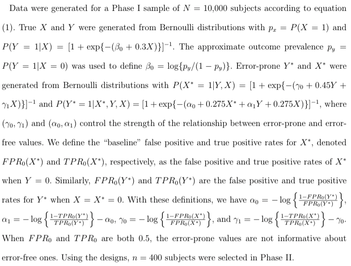

# Optimal Multi-Wave Validation for Secondary Use Data with Outcome and Exposure Misclassification
## Lotspeich, Amorim, Shaw, Tao, and Shepherd
The complete R package `auditDesignR` and code for the simulation settings included in the paper. 

### Install
To install the package, run the following in your `R` console: `devtools::install_github("sarahlotspeich/auditDesignR", ref = "main")`.

### Validation Study Designs

  - *Simple random sampling (SRS):* All subjects in Phase I have equal probability of inclusion in Phase II.
  - *Unvalidated case-control sampling (CC*):* Subjects are stratified on Y* and separate random samples of size n/2 are drawn from each stratum.
  - *Unvalidated balanced case-control sampling (BCC*):* Subjects are jointly stratified on (Y*, X*) and separate random samples of size n/4 subjects drawn from each stratum. 
  - *Optimal design (optMLE):* Subjects are jointly stratified on (Y*,X*), and stratum sizes are chosen following Section 2.2. The optMLE is included as a "gold standard" design since it requires knowing the parameters θ.
  - *Two-wave approximate optimal design (optMLE-2):* Subjects are jointly stratified on (Y*,X*). In the first wave, n/2 subjects are selected using BCC*, and in the second wave the remaining subjects are chosen following the design in Section 2.4.

### Simulation settings 
Inside the `simulations` subdirectory, you will find the following: 

#### Table 1: Simulation results under outcome and exposure misclassification

File: `Table1_SimSetup.R`

#### Table 2: Simulation results under outcome and exposure misclassification with available error-free covariate information

Following equation (1), data were generated for a Phase I sample of N = 10000 subjects. 

Error-free binary covariate Z was generated from a Bernoulli distribution with P(Z = 1) = 0.25, 0.5. True X and Y were generated from Bernoulli distributions with P(X=1|Z) = 1/[1 + exp{-(-2.2 + 0.5Z)}] and P(Y = 1|X, Z)=1/[1 + exp{-(-0.85 + 0.3X + βzZ)}], for βz = -0.25, 0, 0.25. 

Baseline misclassification rates were fixed at FPR0 = 0.25 and TPR0 = 0.75 such that X* and Y^* were generated from Bernoulli distributions with P(X*=1|Y,X,Z) = 1/[1 + \exp\{-(-1.1 + 0.45 Y + 2.2 X + λZ)\}] and P(Y*=1|X*,Y,X,Z) = 1/[1 + \exp\{-(-1.1 + 0.275X* + 2.2 Y + 0.275 X + λZ)\}], where λ = -1, 0, 1. 

In Phase II, n = 400 subjects were selected by extensions of Section 3.1 to sample on (Y*, X*, Z).
